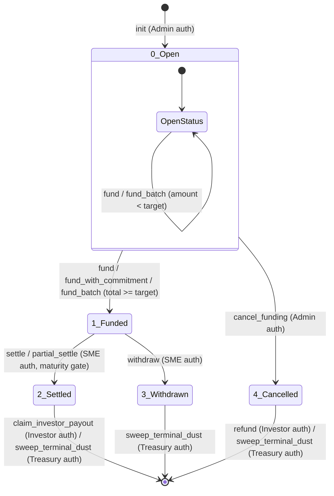

# LiquiFact Escrow State Machine Reference

This document describes the smart contract's state machine, covering status values, transition paths, required authority, legal-hold constraints, and guard behaviors.

---

## Status Definitions

The escrow instance manages its state using a `u32` status field stored under `DataKey::Escrow`. The five valid status states are:

| Status Value | State Name | Meaning |
|---|---|---|
| `0` | **Open** | Escrow initialized; accepts investor contributions. |
| `1` | **Funded** | Target funding met (`funded_amount >= funding_target`). SME may withdraw or settle. |
| `2` | **Settled** | SME has finalized settlement. Payout claims are unlocked. |
| `3` | **Withdrawn** | SME has withdrawn the funded liquidity. Terminal state. |
| `4` | **Cancelled** | Admin aborted funding. Investor refunds are unlocked. |

---

## State Transition Diagram

---

## State Transitions Matrix

Every state transition is guarded by explicit preconditions:

| Entrypoint | Authorized Role | Allowed Source State(s) | Target State | Legal-Hold Gate | Status Precondition Guard | Transition Trigger / Action |
|---|---|---|---|---|---|---|
| `init` | Admin (Implicit via deployer/args) | None (Uninitialized) | `0` (Open) | No | Must not already exist | Creates the initial `InvoiceEscrow` record with `status = 0`. |
| `fund` / `fund_with_commitment` / `fund_batch` | Investor (Self auth) | `0` (Open) | `0` (Open) or `1` (Funded) | Yes | `status == 0` | Pulls tokens from investor. If accumulated `funded_amount >= funding_target`, transitions `status → 1` and writes `FundingCloseSnapshot`. |
| `partial_settle` | SME | `1` (Funded) | `1` (Funded) | Yes | `status == 1` | Does not change status; allows partial off-chain processing before full settlement. |
| `settle` | SME | `1` (Funded) | `2` (Settled) | Yes | `status == 1` | Closes funding round. Unlocks investor payout claims. Enforces `ledger.timestamp >= maturity` if `maturity > 0`. |
| `withdraw` | SME | `1` (Funded) | `3` (Withdrawn) | Yes | `status == 1` | Disburses all funded tokens to the `sme_address`. Terminal state. |
| `cancel_funding` | Admin | `0` (Open) | `4` (Cancelled) | Yes | `status == 0` | Aborts funding round. Unlocks investor refund calls. Terminal state. |
| `refund` | Investor (Self auth) | `4` (Cancelled) | `4` (Cancelled) | No | `status == 4` | Transfers investor's contribution back and zeroes out their recorded contribution. |

---

## Forbidden Transition Matrix

Attempts to transition between states outside of the allowed paths will revert with the following errors:

| From State | To State / Action | Guard Condition Triggered | Typed Error Code |
|---|---|---|---|
| `0` (Open) | `settle()` / `partial_settle()` | Settlement requested before funding target is met. | `SettlementNotFunded` (121) |
| `0` (Open) | `withdraw()` | Withdrawal requested before funding target is met. | `WithdrawalNotFunded` (124) |
| `0` (Open) | `refund()` | Refund requested before escrow is cancelled. | `RefundNotCancelled` (142) |
| `1` (Funded) | `fund()` / `fund_batch()` | Funding attempted after target was already reached. | `EscrowNotOpenForFunding` (103) |
| `1` (Funded) | `cancel_funding()` | Cancellation attempted on a fully funded escrow. | `CancelFundingNotOpen` (141) |
| `1` (Funded) | `refund()` | Refund requested before escrow is cancelled. | `RefundNotCancelled` (142) |
| `2` (Settled) | `settle()` / `withdraw()` | State transition requested on a terminal settled escrow. | `SettlementNotFunded` (121) / `WithdrawalNotFunded` (124) |
| `2` (Settled) | `cancel_funding()` | Cancellation requested on a terminal settled escrow. | `CancelFundingNotOpen` (141) |
| `3` (Withdrawn) | `settle()` / `withdraw()` | State transition requested on a terminal withdrawn escrow. | `SettlementNotFunded` (121) / `WithdrawalNotFunded` (124) |
| `4` (Cancelled) | `settle()` / `withdraw()` | State transition requested on a terminal cancelled escrow. | `SettlementNotFunded` (121) / `WithdrawalNotFunded` (124) |
| `4` (Cancelled) | `fund()` / `fund_batch()` | Funding attempted on a cancelled escrow. | `EscrowNotOpenForFunding` (103) |

---

## State Guard Details & Security Policies

1. **Monotonicity**:
   Once an escrow leaves status `0`, it can never revert to `0`. Once it reaches a terminal status (`2`, `3`, or `4`), it can never transition to any other status.
2. **Mutual Exclusivity of SME Paths**:
   From status `1` (Funded), only one terminal path can be chosen:
   - Settle (`status → 2`) blocks `withdraw()` since status is no longer `1`.
   - Withdraw (`status → 3`) blocks `settle()` since status is no longer `1`.
3. **Legal Hold Power**:
   When `LegalHold` is set to `true`, the following transitions/entrypoints are entirely blocked:
   - `fund()` / `fund_batch()` / `fund_with_commitment()`
   - `settle()` / `partial_settle()`
   - `withdraw()`
   - `cancel_funding()`
   - `claim_investor_payout()`
   - `sweep_terminal_dust()`
4. **Investor Refund Checks-Effects-Interactions**:
   To prevent double-refund attacks in `status 4`:
   - Investor auth is required.
   - Stored contribution is retrieved and verified to be `> 0`.
   - Stored contribution is zeroed out *before* the token transfer occurs.
   - `DistributedPrincipal` is updated to track total refunded capital.
